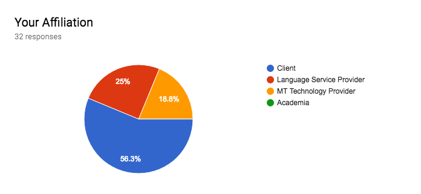
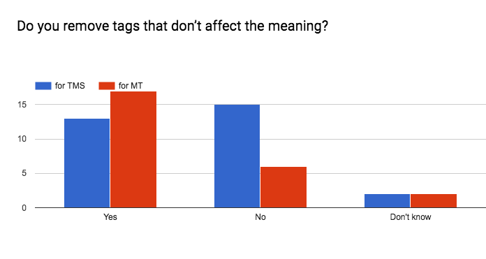
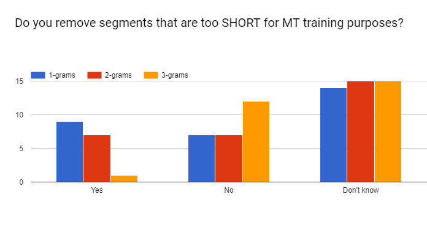

# Best Practices in Translation Memory Management

## Document Revision History

| Version |  Revision Date     | Description|
|---------|--------------------|----------------------------------------------------------------------------------|
| v2.1    |  10 December 2018  | Markdown version|
| v2.0    |  7 December 2018   | Add Creative Commons License|
| v1.5    |  21 September 2018 | First Final Draft After Incorporating Community Feedback|
| v1.0    |  22 May 2018       | First Draft sent by the GILT Leaders’ Forum for Review by GILT community members|

## TM Management Task Force Contributors

Marco Angiuoni  – **VMWare**\
Janice Campbell – **Adobe**\
Johann Cronin – **eBay**\
Sankeshwari Deo – **Autodesk**\
Michael Kuperstein – **Intel**\
Ryan F. Lee – **LDS Church**\
Natalia Levitina – **PTC**\
Lynn Ma – **VMWare**\
Silvio Picinini – **eBay**\
Andrzej Poblocki – **Veritas**\
Vidya Ramachandran – **Adobe**\
Octavio Ramos – **Intel**

## Contact

**GILT Leaders’ Forum**: [https://github.com/GILT-Forum/TM-Mgmt-Best-Practices](https://github.com/GILT-Forum/TM-Mgmt-Best-Practices/issues)

## License

This resource is free for you to use and share as long as you adhere to
the terms of the CC license.

Best Practices in Translation Memory Management is licensed under a
[*Creative Commons Attribution-NonCommercial-ShareAlike 4.0
International
License*](http://creativecommons.org/licenses/by-nc-sa/4.0/).

## Introduction

The GILT Leaders Forum is a self-organized group of seasoned
globalization professionals representing various companies from the
"buyer" side. The group chartered a Translation Memory Management Task
Force to research and produce best practices for translation memory
management, as it relates to translation management systems (TMS/GMS)
and machine translation engine training.

The purpose of this work has been to gather knowledge from TM experts
and transfer it to those responsible for managing TMs in their own
organizations, or on behalf of others.

Upon completion of the first draft, we sought feedback from
practitioners and experts in the wider GILT Community, including
client-side organizations, Language Service Providers, academic and
research institutions, industry forums and localization technology
providers.

In order to reduce redundancy, we requested that information be gathered
across the organization and consolidated as a single response, except
when localization services coexist with technology product or service
marketers.

We received a total of 32 responses, broken down as follows:

In client organizations, internal technical or engineering teams may
perform the TM/MT tasks, while in other cases these activities are
outsourced. In the latter case, a respondent from a client organization
may not have knowledge of, or visibility into, the practices carried out
on their behalf. Since companies that provide technology or services
have many clients with varying requirements, they were asked to respond,
as much as possible, with the most common use cases.

As with any survey, it is possible we did not ask the right question in
the right way. For example, the question “do you do it” is different
than “would you recommend doing it?” It is important to acknowledge this
in an effort to help readers of this document not draw the wrong
conclusions. Upon analysis, a negative response about a practice did not
necessarily imply that it was not done because it was not a good
practice. It may be that the respondent’s organization might not have
the capability, resources, tools, or know-how to do so. The ability to
perform the practice might also be dependent on a TMS or MT engine. Some
practices may turn out to be quite complicated to carry out, and
therefore, the organization may avoid it and focus on those tasks
delivering the highest impact. And finally, it might never have occurred
to an organization to do such a task, but they would have done it if
they had known about it. In some of the comments, respondents expressed
that they wished that they were doing a specific practice.

Throughout the best practices, we have integrated the community
responses from the survey. This information is called out in a yellow
box, which may include charts, in addition to a summary with statistics.
Example:

> __Community Feedback:__
>
> *It is a common practice to remove non-text segments, or remove non-text parts of the segments:*
>
> - *Remove the entire segment, 60%*
> - *Remove the non-word characters, 10%*
> - *Don’t have such practice, 40%*

Our expectation is that this document will help you adopt the practices
that suit your business needs and improve upon the practices that you
already use. In the end, we hope this document increases your knowledge
in this area and that this becomes a living document that will benefit
people over time as well.

## Table of Contents

- [Best Practices in Translation Memory Management](#best-practices-in-translation-memory-management)
  - [Document Revision History](#document-revision-history)
  - [TM Management Task Force Contributors](#tm-management-task-force-contributors)
  - [Contact](#contact)
  - [License](#license)
  - [Introduction](#introduction)
  - [Table of Contents](#table-of-contents)
  - [Definitions/Key](#definitionskey)
  - [Best Practices](#best-practices)
    - [Create an Admin Role to Manage TMs](#create-an-admin-role-to-manage-tms)
      - [Define how TMs are organized](#define-how-tms-are-organized)
      - [Define metadata for TMs](#define-metadata-for-tms)
      - [Determine the plan or principles for using TMs (grouping / leveraging / updating)](#determine-the-plan-or-principles-for-using-tms-grouping--leveraging--updating)
      - [Determine the process and criteria for cleaning TMs](#determine-the-process-and-criteria-for-cleaning-tms)
    - [General TM Housekeeping tasks](#general-tm-housekeeping-tasks)
      - [Create complete descriptions for TMs](#create-complete-descriptions-for-tms)
      - [Use consistent filenames and path normalization to avoid duplicates](#use-consistent-filenames-and-path-normalization-to-avoid-duplicates)
      - [Detect and fix technical issues in the content](#detect-and-fix-technical-issues-in-the-content)
      - [Remove empty segments (source or target)](#remove-empty-segments-source-or-target)
    - [Characters](#characters)
      - [Normalize escaped characters/entities](#normalize-escaped-charactersentities)
      - [Normalize certain control characters](#normalize-certain-control-characters)
      - [Normalize whitespaces](#normalize-whitespaces)
      - [Normalize quotes](#normalize-quotes)
    - [Tags](#tags)
      - [Retain tagged or parameterized variables](#retain-tagged-or-parameterized-variables)
      - [Normalize untagged variable content](#normalize-untagged-variable-content)
      - [Removing tags that don’t affect the meaning](#removing-tags-that-dont-affect-the-meaning)
    - [Duplicates](#duplicates)
      - [Identify and remove duplicates with no context for MT training purposes](#identify-and-remove-duplicates-with-no-context-for-mt-training-purposes)
      - [Identify and remove In-Context Exact (ICE) duplicates for TMS](#identify-and-remove-in-context-exact-ice-duplicates-for-tms)
    - [Age/Obsolete](#ageobsolete)
      - [Remove segments for being older than a certain age](#remove-segments-for-being-older-than-a-certain-age)
    - [Remove low value entries](#remove-low-value-entries)
      - [Check if a segment contains mostly non-text content](#check-if-a-segment-contains-mostly-non-text-content)
      - [Characters that do not match either the expected source or target language](#characters-that-do-not-match-either-the-expected-source-or-target-language)
      - [Do not remove segments where source = target](#do-not-remove-segments-where-source--target)
      - [Check unbalanced brackets](#check-unbalanced-brackets)
      - [Remove entries consisting of only punctuation, whitespace, or tags](#remove-entries-consisting-of-only-punctuation-whitespace-or-tags)
      - [Remove segments that are too long](#remove-segments-that-are-too-long)
      - [Remove segments that are too short](#remove-segments-that-are-too-short)
    - [Inconsistency](#inconsistency)
      - [Identify segment inconsistencies and fix if appropriate](#identify-segment-inconsistencies-and-fix-if-appropriate)
    - [Terminology](#terminology)
      - [Identify terminology inconsistencies](#identify-terminology-inconsistencies)
    - [Misalignments](#misalignments)
      - [Check sentence length ratios](#check-sentence-length-ratios)
    - [TM Maintenance](#tm-maintenance)
      - [TM Maintenance Tools](#tm-maintenance-tools)
      - [TM Backups](#tm-backups)
  - [Summary Table of Recommended Tasks for TMs](#summary-table-of-recommended-tasks-for-tms)

## Definitions/Key

|Symbol| Definition|
|---|---|
|✔️| Recommended practice.|
|❌| Not recommended or not valid for this use case.|
|⚠️| Proceed with caution. This may or may not be a good practice depending on your environment. You may want to consult with your TMS and/or MT service providers for tool-specific guidance.|
|**TMS**| Translation Management System (aka Globalization Management Systems (GMS) or Global Content Management Systems (GCMS)). A type of software for managing the content workflow within the human translation process.|

## Best Practices

### Create an Admin Role to Manage TMs

TMS: ✔️ MT: ✔️

It is recommended to assign an Admin role within your organization to
oversee and manage Translation Memories. The TM Admin role would manage
the organizational structure of the TMs. This might include:

- Oversee the cleanup of TMs

- Grouping/hierarchy of workflows

- Prioritization and updating of TMs

- Definition of metadata

Specific recommended practices for this role may include:

- Approve creation of new TM groups

- Recommend removal of temporary (e.g. test or seed) or non-relevant TMs

> __Community Feedback:__
>
> *83% of respondents have an admin role in one form or another, while 17% do not have it.*

#### Define how TMs are organized

TMS: ✔️ MT: ✔️

Categorizing TM content is a challenge for every company and differs
depending on each client’s strategy and portfolio.

Many considerations factor into deciding when to silo content into
separate TMs. Some strategies are designed to maximize leverage, while
others focus on maximizing the quality of translation leveraged.

---

ℹ️ **Tip**: It’s possible for content from multiple sources to coexist in the same TM if the translation style is the same. This strategy can help minimize the number of TMs you need to maintain.\
Having more TMs increases TM maintenance effort and reduces usefulness of each TM. So maintain as few TMs as possible, but as many as necessary.

---

Here are some considerations that may help determine your TM hierarchy:

- **Language Separation**
  - Split each language into a separate TM, or
  - Store all languages in one TM

- **Separate TMs by Product**\
  Group by Product family/Business unit/Code stack (i.e. keep distinct TMs for each product area).

- **Separate TMs by Translation Style**\
  If the same style guide is used to translate several different
  components, it may make sense to group all such content into one TM,
  regardless of the source (e.g. keep all your different product content
  in one TM).

- **Group by Screen Size**\
  Different devices impose size restrictions/constraints on translation
  length.
  - You may need to separate TMs based on intended use (desktop vs mobile)

- **Separate TMs based on Quality of Translation**\
  Sub-divide TMs based on quality of translation, or keep all in one.
  - You may elect to keep *length-restricted* translations separate.
  - You may elect to keep *reviewed* content separate to *unreviewed* content.
  - You may elect to keep *machine-translated* content that went through
    light post-editing (to achieve “fit for purpose” quality) separate
    from content translated to full human quality (using MT + full
    post-editing and/or CAT tools).

Other arrangements are also possible but may not bring *not bring much
benefit; rather they just bloat the number of TMs to maintain.* e.g.

- **Separate TMs by every Code base/File Type**\
  Group by code stack or file type (i.e. keep distinct TMs for each
  type of file being processed).

---

**⇨ CASE STUDY: Example of TM separation at Company A**

- Separate TMs were created for:
  - Mobile (iOS & Android)
  - UI
    - All goes into one TM
    - One product with length-restrictions (for UI) stored in separate TM
  - Web content
  - Help content
  - Documentation
  - Customer support
  - Misc TM (Legal text, Marketing text, graphics localization, Survey docs, etc…)
- TMs use a uniform naming convention, for consistency and to help group TMs by name
- TMs have detailed descriptions for all TMs so everyone knows exactly what they should contain

---

>__Community Feedback:__
>
>*TMs are organized by the respondents using the following criteria, in the order of popularity (multiple options allowed):*
>
>- *Product Family/Business Unit/Code Stack, 78%*
>- *Language, 66%*
>- *Content Type (UI/DOC/Web), 63%*
>- *Translation style, 34%*
>- *Quality (length-restricted, machine-translated, possibly unreviewed), 28%*
>- *Screen Size (desktop vs. mobile), 9%*

#### Define metadata for TMs

TMS: ✔️ MT: ✔️

Define the metadata required to organize TMs. This helps to be able to
organize the content of the TMs in different ways for specific purposes.
Recommended attributes (even if not available in TMS systems) include:

- Product
- Vertical/Subject
- Type of Content (UI, Help, Doc, Short/Long, User Generated or Not)
- Style (Formal vs. Informal, or Research vs. Gaming)
- Visibility (Internal vs. Published) - which influences the quality need
- Quality Level (Perfect vs. Good Enough)
- Bilingual/Multilingual TM

>__Community Feedback:__
>
>*Most respondents are already using metadata to capture product, type of data and bilingual/multilingual information.*
>
>*The most desirable metadata that some of the respondents are not using now and would like to add are:*
>
>- *Quality Level (Perfect v. Good enough)*
>- *Style (Formal vs. Informal, Research vs. Gaming)*
>- *Visibility (Internal vs. Published)*
>- *Vertical/Subject*
>
> *TM metadata is used to maximize quality and leverage, as well to identify the most effective MT training data. One of the users noted a need to track usage analytics for TM matches to facilitate TM maintenance.*

#### Determine the plan or principles for using TMs (grouping / leveraging / updating)

TMS: ✔️ MT: ✔️

Determine the stated plan or guiding principles for grouping, priority, applying, penalization, and updating of TMs.

- Grouping / Hierarchy
- Priority or Sequence (list of 5 TMs in prioritized order, for example)
- Leverage Penalty (if any) for each TM in the sequence
- Which TM(s) is/are updated after translation

📓 **Note**: Keep your leveraging rules simple. Leveraging from a very
large number of TMs has dubious benefits with a higher risk of adding
complexity and potentially reducing quality. For some TMS systems,
reducing the number of TMs leveraged is a recommended practice due to
quality and performance concerns. Consult with your TMS provider for guidance.

**It is not recommended** to update to multiple TMs after translation.

**It is recommended** to have a structured approach to managing TMs,
otherwise cleanup efforts are not as effective.

---

ℹ️ **Group TM Considerations**

Many TMS allow you to reference other TMs in order to maximize the
leverage potential of your corpus. Most TMS allow you to apply penalties
to any leverage you get from reference TMs, in order to ensure the
content appears as a fuzzy match requiring review, before being
committed to the write-to TM. Consider the options below:

- **Leverage from TMs with length restrictions?**\
  *Translations may be compromised by the screen limitations or UI
  restrictions. Do you want to reference TMs that contain abridged
  translations?*

- **Leverage from TMs with different translation style?**\
  *Do you want to reference TMs that use a different translation style
  guide, e.g. formal v informal?*

- **Leverage from unreviewed TMs?**\
  *Do you want to reference TMs that contain unreviewed content, e.g.
  internal training content, perhaps inconsistent with your your term
  database?*

- **Leverage from Machine Translated TMs?**\
  *Do you want to reference TMs that contain machine-translated content,
  (reviewed, or not)?*
  *If you reference reviewed MT content, do you want to reference only
  full human-quality or good-enough (fit for purpose) quality?*

---

ℹ️  **Apply Penalties**

In all the above cases you should apply a penalty against any references
coming from the lesser-quality TM, or from one that uses a different
translation style, in order to ensure it gets properly reviewed before
being used.

---

>__Community Feedback:__
>
>*Most respondents are using a stated plan or guiding principles for using their TMs based on:*
>
>- *Priority or Sequence, 78%*
>- *Leverage Penalty (if any) for each TM in the sequence, 66%*
>- *Which TM(s) is/are updated after translation, 66%*
>- *Grouping / Hierarchy, 59%*

#### Determine the process and criteria for cleaning TMs

TMS: ✔️ MT: ✔️

Define why, when, and how TMs should be cleaned:

- Define separate processes for cleaning TMs for a TMS and for MT.
- Set a schedule for cleaning.
- The general practice for MT is to exclude all segments where the
  source is ‘suspicious’ or does not look like a sentence, so that
  non-fluent data does not affect the MT engine quality.
- Weigh the cost/benefits of having a very dirty TM against the value
    of high leverage for a particular project. Consider that allowing
    junk segments into the TM because they give high leverage for a
    particular project, then the result is that these junk segments
    are only appropriate for that particular project, and the segments
    may not be as suitable for other projects in general.

📓 **Note**: You may wish to tag and archive all verified wrong translations
for future use in Machine Learning, as an example of a bad translation.

---

ℹ️ Criteria that may be considered in decisions about cleanup:

- Age of the segment (last modified date / last used date)
- Terminology updates
- Duplicates
- Changes in style (formal to informal, for ex.)
- Segment analysis (corruption, incorrect language, mismatching count
   of format parameters, etc.)

(A detailed list of cleaning criteria is contained in the sections
below.)

---

>__Community Feedback:__
>
>- *About a half of respondents perform cleanup operations for TMS purposes by implementing terminology updates and by modifying “wrong” segments.*
>- *Around a third of respondents perform all the other cleanup operations for the TMS maintenance purposes on a schedule (deleting “wrong” segments, based on segment age, segment analysis, changes in style and duplicates).*
>- *Between 30 and 45% of respondents perform cleanup operations on a schedule for the MT purposes by deleting or modifying “wrong” segments and doing segment analysis. A quarter of users delete duplicates for the MT training purposes.*
>- *Only 13-20% of respondents do not perform any cleanup tasks for either TMS or MT purposes.*

### General TM Housekeeping tasks

*These are language-independent tasks, meaning that these tasks should
be applied across all languages.*

#### Create complete descriptions for TMs

TMS: ✔️ MT: ❌

The TM 'Description' field is critical in helping to differentiate and
describe TM contents and use. It’s especially useful when you have
multiple Admins creating TMs. Recommended practice.

---

**⇨ Example syntax:**

\[User's initials\] \[Date\] \[Description of TM\]

---

📓 **Note**: Some TMs are temporary, used to seed other languages (e.g. French to French-Canadian), so they have a shelf life. Knowing who created it, when, and having a useful description helps know how it's used and when to delete.

>__Community feedback:__
>
>*Community feedback indicates that a higher percentage create complete TM descriptions for TMS vs. MT.*

#### Use consistent filenames and path normalization to avoid duplicates

TMS: ✔️ MT: ❌

**Consistent filenames**: Avoid submitting a project file to translation with a different filename
each time the content is updated (e.g. `localization\sprint1.xml`,
`localization\sprint2.xml`). Such a practice would create multiple
entries in the TM for the same content because the filename is different
each translation cycle (or sprint).

**Path normalization**: Use path normalization in conjunction with using consistent filenames,
to reduce creation of TU duplicates. Recommended practice.

📓 **Note**: This practice is not relevant for all TMS or for systems that use alternatives to TMs (e.g. documents in Transit or LiveDocs in memoQ).

---

**⇨ SDL WorldServer Example**

BEFORE path normalization:

Before path normalization is introduced, the same TU is saved 4 times into a TM even when no changes have been made to the translation – original TU plus 3 duplicates with the following ‘Entry Origin’ attribute values:

`/FileSystem/Projects/ProductA/Version1/batch1/foo.htm`\
`/FileSystem/Projects/ProductA/Version1/batch2/foo.htm`\
`/FileSystem/Projects/ProductA/Version2/batch1/foo.htm`\
`/FileSystem/Projects/ProductA/Version2/batch2/foo.htm`

AFTER path normalization:

Entry Origin for all 4 cases looks like this:

`/FileSystem/Projects/foo.htm`

Therefore no duplicate TUs are created.

---

>__Community Feedback:__
>
>*Most respondents indicate a preference for creating consistent filenames for updated content & using path normalization.*

#### Detect and fix technical issues in the content

TMS: ✔️ MT: ❌

If you find character corruption, escaping, or other quality issues in
the source, look upstream at the source content and then the
filters/parsers to investigate why those issues happened, e.g.:

1. Encoding issues in the source can cause character corruption in the
   translated assets, especially if non-English accented characters
   are not supported by the chosen code page/encoding.

2. Escape characters (such as \\n, \\r) should not be included as
    translatable elements since that increases the risk of translators
    incorrectly interpreting or omitting these. Character escaping
    should occur outside of the content bundle so linguists can
    translate content without seeing backslashes in the source, or
    worrying about adding escape sequences in the translated assets.
    Similarly, it’s not good practice to escape quotes in the source
    content (e.g. Can\\’t). Instead, have a post-processing function
    to escape characters where needed.

3. Check your filter/parser rules to ensure your content is sent
    correctly for translation and the untranslatable tags are
    identified as such.

⚠️ If the issue is with the filter/parser, it should be fixed before any
effort is expended on cleaning, to avoid losing leverage. Plan parser
changes carefully because parsing affects matches at every level (ICE,
100% and fuzzy matches). If the parser and the cleanup efforts are not
done in a coordinated fashion, a leverage loss will occur.

---

**⇨ Examples:**

- Character corruption needs investigation.
- Escaped HTML entities (or double-escaped entities) often indicate an
  issue that should be fixed in the parser.
- Line breaks at 80 characters may indicate a parser that should do a
  better job of parsing text to flow across lines.

---

>__Community Feedback:__
>
>Most respondents have a process in place to fix corruption issues.This area continues to be a challenge for 20% of those surveyed.

#### Remove empty segments (source or target)

TMS: ✔️ MT: ✔️

This cleanup step is applicable regardless of language. Recommended
practice. Some systems or configurations prevent this from happening,
but that is not always the case.

>__Community Feedback:__
>
>*For cleanup purposes, 64% of respondents remove empty segments for TMS and 75% for MT.*
>
>*Some TMS can be configured to not produce empty segments, so for those systems this is a non-issue.*

### Characters

⚠️ Take extreme care with any normalization during cleanup;
over-normalization can lead to loss of information and/or loss of
leverage.

- Inspect the incoming source text for escaped characters/entities,
    control characters, or excessive white space. If these exist, look
    upstream at the parsers for the source of these issues before
    cleaning them from the TMs.
- When sending content to an LSP for translation, the text should be
  raw unescaped characters.
- There are many exceptions to general normalization rules based on
    the file type, parser, and content type. Consider your specific
    use case and needs before taking any action.

#### Normalize escaped characters/entities

TMS: ⚠️ MT: ✔️

**Definition:** “Escaped” characters are representations of characters
using only ASCII characters. For example, `&\#x20AC;` is the escaped
representation of the Euro symbol.

**Recommended Practice:** Replace all escaped HTML entities with the
actual Unicode character, including these common ones:

- `&lt;` (&lt;)
- `&gt;` (&gt;)
- `&amp;` (&)
- `&nbsp;`

This enables the text to be more readable and more easily searched (e.g.
during QA phase).

**How:** TMS systems can store non-ASCII Characters as either characters
or entities. It’s recommended to store *characters* in the TM to make
sure that an unescaped version of source content is used during the TM
leveraging and translation process.

Benefits:

- Content is much easier to read, translate, and to troubleshoot.
- Data in the TMs is independent of source content type.
- Normalizing to unescaped characters across all your content should
  produce better leverage.

Restricted characters must be escaped again before the final content is
delivered.

📓 **Note**: When working with XML files, there a 5 ‘special characters’ that
must be stored as entities in the XML output to avoid parser issues
(i.e. *&amp; &apos; &gt; &lt; &quot;*). These can be stored as
characters in the TM, but as entities in the translated XML output.

> __Community Feedback:__
>
>- *50% of respondents normalize characters/entities for TMS & MT.*

#### Normalize certain control characters

TMS: ⚠️ MT: ✔️

**Definition:** Control characters are codepoints that do not represent
written symbols, but rather perform some other function in a document
(formatting, spacing, legacy functions that are no longer used, etc.). A
list of control characters can be found at:
[*https://en.wikipedia.org/wiki/Control\_character*](https://en.wikipedia.org/wiki/Control_character).

Recommended Practice: Remove certain control characters, such as
non-printable characters.

📓 **Notes**:

- Non-printable characters such as the BELL or Unicode Byte-Order-Mark
    sequence in TM data may indicate corruption from a bad parser or
    other data source, so consider inspecting and correcting upstream
    sources if you find these.
- Unescaped non-printable control characters are not legal in XML file
    content, and must either be removed or escaped before
    further processing.
- Tab, new line, and other whitespace characters are also considered
   ‘control’ characters, but we address them separately in the
   next sections.

>__Community Feedback:__
>
>- *43% of respondents normalize control characters for TMS and MT.*

#### Normalize whitespaces

TMS: ⚠️ MT: ✔️

Collapse series of white spaces to one instance.

📓 **Note**: Some TMSs allow the option of storing a sequence of whitespaces as
a single space.

⚠️ Caution:

- There are 31 whitespace characters listed in the Unicode standard,
     with specific linguistic rules or technical uses for
     certain languages. Hence, removing all whitespace characters
     without analysis is not advisable.

- The decision of whether to normalize whitespace should be dependent
     on advice from the tool vendor, analyzing the content, and the
     translated output.

>__Community Feedback:__
>
>- *44% of respondents normalize whitespaces for TMS.*
>- *53% of respondents normalize whitespaces for MT.*

#### Normalize quotes

TMS: ❌ MT: ⚠️

Recommendation for MT training only, in order to have a consistent input
for all content, it is suggested to perform various quotes conversions:

- Source & Target: Convert curly single quotes to regular
  single quotes.
- Source & Target: Convert curly double-quotes to
  regular double-quotes.

Conversion of curly quotes to straight quotes helps introduce
consistency into the MT training corpora and may correct some errors in
technical content, where code was typed or copied from a word processor.

Other search and replace quote operations include substituting
non-English (e.g. Chinese, Japanese and French) quotes with English
double-quotes and/or removing all double-quotes. Performing these
conversions should be done carefully due to risk of introducing errors,
possibly technical or linguistic.

⚠️ Caution: There are different views on this practice, with some people
considering that these conversions are not a recommended practice.

- Target: Convert Japanese and Chinese single and double quotes to
    full-width single and double quotes, respectively.
- Target: For French (France), convert curly single and regular single
    quotes to the left and right guillemet characters (« »), with a
    non-breaking space after the left guillemet, and a non-breaking
    space before the right guillemet. For French Canada, do not
    include the non-breaking spaces.
- Remove all standard double quotes.

> __Community Feedback:__
>
>- *70% of respondents do not normalize quotes in the SOURCE*
>- *65% of respondents do not normalize quotes in the TARGET.*

### Tags

#### Retain tagged or parameterized variables

TMS: ✔️ MT: ✔️

**Definition**: Tagged or parameterized variable content is a variable
inserted in the text to represent any possible value. For example, “{0}
not found” or “&lt;ITEMID&gt; not found” means that ITEMID will be
replaced by an actual ID for an item.

These tags should be retained as-is to avoid breaking the meaning of the
sentence.

>__Community Feedback:__
>
>- *88% of respondents retain tagged or parameterized variables for TMS.*
>- *84%% retained these variables for MT purposes.*

#### Normalize untagged variable content

TMS: ❌ MT: ✔️

**Definition**: Variable content is content that can be replaced by a
variable name to increase the usability of the data. The replacement of
numbers is a good example. A sentence such as “I have worked here for 6
years” would only help the translation of sentences containing “6 years”
but not 7 or 8. Replacing the number 6 with a variable such as \$num
will make this a number-neutral sentence.

---

**⇨ Example**

- “You have 5 emails.” &gt;&gt; “You have 0 emails.”
- “Edited on 10:49 AM Feb 9” &gt;&gt; “Edited on 0:00 AM Jan 1”

---

Although it is not a common practice to normalize an untagged variable,
doing so during pre-processing of MT corpora (convert numbers to \$num)
and input text may enhance leverage. Such a practice may be dependent on
the MT engine.

>__Community feedback:__
>
>- *For MT, 68% responded they do NOT normalize untagged variables.*
>- *For TMS, 72% do NOT do this practice.*
>
>*For the most part, this is not a recommended practice, according to feedback from the GILT community.*

#### Removing tags that don’t affect the meaning

TMS: ❌ MT: ✔️

**Definition**: Tags that don’t affect meaning are formatting tags.

- HTML Formatting: &lt;b&gt;This is bold.&lt;/b&gt;
- Trados style inline markup: {\\cs6\\f1\\cf6\\lang1024
    &lt;/ut&gt;&lt;strong&gt;&lt;ut&gt;}
- Trados font tags: {\\f2 Le sedi del training non sono comode da
    raggiungere}

>__Community Feedback:__
>
>- *74% of respondents say they *do* remove tags not affecting the meaning for MT purposes.*
>- *For TMS, 46% remove these tags.*
>
> 
>
>*For TMS, there is not a strong consensus on the practice to remove these types of tags. It may be dependent on the TMS used or the pre-processing steps to prepare an MT corpus. This practice is followed, in general, more widely for MT purposes.*

### Duplicates

While some duplicate segments in the TM are needed for ICE-matching
purposes, it is otherwise good practice to remove unnecessary duplicates
from TMs. This improves data quality, leverage and performance of TMs.

#### Identify and remove duplicates with no context for MT training purposes

TMS: __N/A__ MT: ✔️

Machine translation engines use only source and target sentences with no
context from metadata. In this scenario one should remove duplicates
where two segments have the same source and the same target, that is, an
identical translation.

>__Community Feedback:__
>
>- *63% of respondents remove duplicates for MT training purposes*.
>- Overall, survey results support the practice of removing duplicates.

#### Identify and remove In-Context Exact (ICE) duplicates for TMS

TMS: ❌ MT: __N/A__

In-Context Exact matches are matches that go beyond having the same
source and target. They have more information in common that further
guarantees that the translation is appropriate to the context. For
example, besides the current segment being translated, also the previous
and next segments are the same.

📓 **Note**: If you have duplicates of ICE matches you may want to apply
practices of path normalization to avoid this.

>__Community feedback:__
>
>- *70% of TMS respondents do not remove ICE duplicates.*
>- *Survey results support retaining ICE duplicates.*

### Age/Obsolete

#### Remove segments for being older than a certain age

TMS: ⚠️ MT: ⚠️

Metadata such as Usage Count, Last Used, and Last Updated can indicate
if a certain segment is being actively leveraged.

📓 **Note**: This practice is **not broadly recommended** and should be carefully
evaluated for your use case.

Reasons for removing older segments:

- Significant changes in style (for example, from formal to informal)
     may indicate the need for removing content older than the date
     of change.
- TMs may grow too large causing leveraging and updating to take a
     long time.

Reasons against removing older segments:

- Old segments might used years later, such as for warranty work.
- Should keep everything for MT.

📓 **Note**: Removing old TM entries may reduce your ICE leverage results.
Recreating TMs from latest files is one solution to identify only
active/relevant TM content. Consider if applicable to your use case.

>__Community Feedback:__
>
>*The majority of respondents (70% for TMS and 76% for MT) do not remove old segments.*
>
>*Respondents keep older TM entries because:*
>
>- *The content is still active despite not being updated recently, and may need to be leveraged at any time (e.g. when supporting older products or legacy code)*
>- *Inactive & older translations still have potential use in machine translation training*
>- *To maintain term history*
>- *No easy way to purge the TM to retain only ‘active’ terms*
>- *The TMS shows no data on when term was last leveraged, so it’s unclear what can be safely deleted.*
>- *Fear of corrupting TMs*
>
>*Respondents remove older TM entries because:*
>
>- *Size reduction*
>- *Terms are updated often, so older terms are deprecated*
>- *Old terms are moved from main TM to a secondary TM reference (sometimes with penalty)*
>- *Cost*
>- *Quality/Consistency/Usefulness of content*
>- *Performance*

### Remove low value entries

#### Check if a segment contains mostly non-text content

TMS: ❌ MT: ✔️

Exclude segment (for MT) if a high percentage of the characters are
non-word characters.

>__Community Feedback:__
>
>*It is a common practice to remove non-text segments, or remove non-text parts of the segments:*
>
>- *Remove the entire segment, 60%*
>- *Remove the non-word characters, 10%*
>- *Don’t have such practice, 30%*

#### Characters that do not match either the expected source or target language

TMS: ⚠️ MT: ✔️

Identify if there are characters in the source or target that should not
be used in that language.

For TMS, check for it, but do not necessarily delete automatically
because there may be valid mixed character sets in a segment.

For MT, consider removing the entire segment that contains characters in
the translation that don't fit into the expected charset for the target
language, using mapping tables available from Unicode.org

📓 **Note**: Corrupted characters may be identified as a result of the checks
7.1 and 7.2 above. Corrupted characters should not be in the source
content bundles and should be reported to the developers for
removal/fix.

>__Community Feedback:__
>
>*It is a common practice for the MT:*
>
>- *Remove the entire segment, 53%*
>- *Remove the non-word characters, 5%*
>- *Don’t have such practice, 42%*
>
>*But not for the TM:*
>
>- *Remove the entire segment, 29%*
>- *Remove the non-word characters, 0%*
>- *Don’t have such practice, 71%*

#### Do not remove segments where source = target

TMS: ✔️ MT: ✔️

Typically, content that should not be translated should be hidden during
the translation process and should not be saved in TMs. However, some
content that should not be translated cannot be automatically
distinguished from content that should be translated. For example,
brands, product names, or copyright statements might not be translated,
but are likely to be mixed in with translatable content. In this case,
it would be ideal to use terminology management system to manage this
content and ensure that it is handled correctly. This way the content is
actively managed and kept up-to-date with the organization’s current
standards.

However, if a robust and well-managed terminology solution is not
available, an acceptable alternative is to store untranslated segments
in TMs, with the target content identical to the source content.

For MT training, it is desirable to use a dictionary or terminology
functionality provided by the MT system. However, if this is unavailable
or undesirable for some reason, TM entries with identical source and
target data can also be used for training MT systems to increase the
likelihood that the MT system will learn to leave these special terms
untranslated.

>__Community Feedback:__
>
>- *Only 4% of the responders have a practice of removing such segments in TM*
>- *Only 14% of the responders have such practice for MT*
>
>*Most responders have other ways of dealing with (filters, terminology), and validating that the untranslated segments are correct.*
>
>*Those who remove such segments don’t want the MT system to learn to leave segments untranslated.*

#### Check unbalanced brackets

TMS: ✔️ MT: ✔️

If there is an opening parenthesis and no closing one, it may simply be
a typo, missing from the source/translation. If the closing parenthesis
appears on the next segment this can signify bad segmentation/incomplete
sentences. In that case, check the cause for the sentence being split
into multiple segments (e.g. abbreviation) and correct the sentence
breaker rules to keep the sentence whole.

MT recommendation: compare to the source. If it does not match the
source, then remove.

>__Community Feedback:__
>
>*It is not a common practice to validate the brackets*
>
>- *Only 22% of responders have such a practice*

#### Remove entries consisting of only punctuation, whitespace, or tags

TMS: ✔️ MT: ✔️

Segments consisting of only punctuation, whitespace, and tags are not
translatable. Entries without any translatable text are generally not
useful and should be removed from TMs and MT corpora.

>__Community Feedback:__
>
>- *35% of responders have such a practice for the TM*
>- *78% have such practice for MT*
>
>*It is more common to have additional validation of the corpora for the MT training.*

#### Remove segments that are too long

TMS: ❌ MT: ✔️

For MT training, some segments may be too long to be useful and should
be removed from the training corpus. As an example, the open-source
Moses MT system automatically removes any segments that contain more
than 80 words.

>__Community Feedback:__
>
>- *45% of responders have this practice*

#### Remove segments that are too short

TMS: ❌ MT: ✔️

For MT training, some users consider that short (one-word) segments may
introduce unnecessary inconsistencies or ambiguity due to homonym usage
and lack of context, and remove such segments. Other users consider that
short segments contain valuable target content, that helps the MT
resolve ambiguities and increase vocabulary coverage, and don’t remove
such segments.

Here is a general recommendation from one MT provider.

1\) 1-grams: Do not include in the training data. As a general rule,
1-gram sequences are not good training data for both SMT and NMT
systems. For both types of MT, the context for the use of a word is
learned from the sequence/segment it belongs to. This is especially
relevant in languages that are highly inflected.

2\) 2-grams: Do not include in the training data. Learning is not optimal
in terms of the context in which the words are used and how they relate
to each other. However, including them does serve to beef-up the word
alignment and vocabulary of your engine.

3\) 3-grams: Include in the training data. For languages that are highly
inflected, 3-gram sequences offer the opportunity to learn about
gendered spelling and inflections.

>__Community Feedback:__
>
> 
>
>*Please note that the response rate for this question was low, suggesting that most of the responders don’t have any practice around 1-, 2- and 3-grams.*
>
>*From those who responded: It is a more common to remove 1- and/or 2- grams, but not 3-grams:*
>
>- *53% of the responders remove the 1-grams and 2-grams*
>- *Only 8% (1 responder) also remove 3-grams*
>
>*Majority of the responders agree with the practice of removing segments that are too short or too long (even if not doing it right now).*

### Inconsistency

#### Identify segment inconsistencies and fix if appropriate

TMS: ✔️ MT: ✔️

Analyze the TM and identify inconsistencies. A linguist should determine
if a change or removal is warranted.

Examples:

- Same source and two different targets. Some may be valid
    inconsistencies, for different meanings.
- Same target for two different sources. Some may be valid
     inconsistencies, for similar sentences in source being translated
     the same, thanks to fuzzy matches. But it can also be a wrong
     translation, an accepted fuzzy match that does not match
     the source.

>__Community Feedback:__
>
> *There was no prevalent practice either for TM or MT maintenance.*
>
> *Respondents that **perform** maintenance:*
>
>- *Have developed their own data normaliser and can write rules to normalise their training data.*
>- *Manage this process via their vendor*
>- *Perform the maintenance every 6 months*
>- *Use tools, scripts & macros to run quality checks on TMs, then fix manually (i.e. the scripts may be proprietary but updates are performed by a linguist, not programmatically)*
>- *Some TMS have a setting to keep only one translation for same source in TM*
>
>*Tools mentioned included Oliphant and ApSIC Xbench.*
>
>*Some TMS have built-in QA checks and segment filters to alert user to review same-source-different-target, different-source-same-target, fuzzy match accepted but not edited.*

### Terminology

#### Identify terminology inconsistencies

TMS: ✔️ MT: ✔️

Use a Terminology Database to identify deprecated or rejected terms,
potential new terms, and incorrect terms in the TM. Review the resulting
inconsistencies between the Terminology Database and the TM. This
requires a linguist review, since there are likely to be false positives
in this check.

📓 **Note**: Some TMS systems have mechanisms to do this for you. Consult with
your TMS provider.

>__Community Feedback:__
>
>- *45% of **TMS** respondents identify and fix terminology inconsistencies in translation memory.*
>- *38% of **MT** respondents identify and fix terminology inconsistencies in translation memory*
>
>📓 ***Note:** The results do not necessarily indicate a best practice, only that people generally aren’t taking action to identify and fix terminology, for many possible reasons. Many of the respondents who aren’t currently identifying and fixing terminology inconsistencies still consider it a best practice.*
>
>*Tools mentioned as solutions for fixing inconsistencies included ApSIC Xbench, Okapi Olifant, SDL Multiterm, memoQ, XTM automatic QA checks, and various internal scripts or tools.*

### Misalignments

It sometimes happens that source segments are associated with targets
that do not represent a valid translation of the source content. This
can often happen when existing bilingual data is automatically broken
into sentences, for example. It is therefore worthwhile to periodically
scan your TM data and check for a few criteria that may indicate that
the source and target are mismatched. In the TMS case, these segments
should not be automatically deleted, but rather flagged for a linguist
to review. For MT it may be acceptable to automatically remove segments
that seem to be misaligned.

#### Check sentence length ratios

TMS: ⚠️ MT: ✔️

Inconsistent sentence length ratios between source and target may
indicate a misalignment. This may be measured in terms of words or in
terms of characters. Note, however, that the acceptable length ratio
will depend on the language pair under consideration; for example, one
would expect a Chinese translation of an English sentence to contain
significantly fewer characters than a German translation of the same
sentence.

>__Community Feedback:__
>
>- *For TMS, 81% of respondents responded No.*
>- *For MT, 52% of respondents responded No*
>
>*Survey respondents were more significantly less likely to use sentence length ratios to identify bad segments for TM's.*
>
>📓 ***Note:** The results do not necessarily indicate a best practice, only that people generally aren’t identifying bad segments using sentence length ratios, for many reasons. However, we still consider this practice a useful practice, and it is recommended by this group.*

### TM Maintenance

#### TM Maintenance Tools

TMS: ✔️ MT: ✔️

Many commercial TMS have built-in TM utilities but open-source tools are
also available to perform TM processing, QA checks or other TM
management tasks.

- Okapi Framework (open-source localization & translation tools):
  - Olifant: view and process TMX files.
  - Rainbow: Generate TMX from XLIFF or bilingual files for
     importing into your TMS
  - CheckMate: allows you to perform various quality checks on
     bilingual translated documents
- GlobalSight Suite (open-source Translation Management System)
- Various Quality Assurance and Terminology Management tools
- Various Machine translation platforms/tools

Many companies also opt to develop proprietary tools for workflow
services, TM storage and terminology management, using TMS SDK and APIs.

#### TM Backups

TMS: ✔️ MT: ✔️

DAILY BACKUP OF PRODUCTION DATABASE

Your database administrator should have a robust backup plan in place so
that if your database has issues or data gets corrupted, there’s an
available backup to go to.

- Production data is backed up to a ‘standby’ database, with write-delay\
  *(i.e. there’s usually 8 - 24 hour delay before copying data to the
  standby database).*

  The delay in writing to the backup database is intentional, so that
  major corruption or deletion of data in the primary database doesn’t
  equally compromise the backup database, thus allowing you to still
  recover data.

TM BACKUPS VIA API

In addition to the database backup managed by your DBA, it’s also
prudent to have backups of your TM managed by your TMS Administrator.
You can achieve this by:

- Manual backup (TM &gt; Export)
- Automated backups (via API calls)

TM exports of this nature can be more finite so you can can have local
TMX copies of each of your TMs, easily accessible to the team for
reference and error recovery, or for use with MT training.

- User error - TM entries accidentally deleted and need to be restored
- MT corpus - TMX file is available for MT processing

You can set your own schedule for such backups, but a monthly cadence
may suffice.

---

*Example of TM Backup in use:*

A user searches for a term in the TM and intends to export the results, but accidentally deletes all search results instead.

*Solution:*

The TMX backup is searched using the same search parameters as the original user query and the results are imported back into the TMS, thus restoring the TM to its original state. No DBA is required and the fix is achieved within hours.

---

## Summary Table of Recommended Tasks for TMs

| Task                                                                                 | For TMS | For MT |
|--------------------------------------------------------------------------------------|---------|--------|
| [*Create an Admin role*](#create-an-admin-role-to-manage-tms)                       | ✔️ |         ✔️|
| Define how TMs are organized                                                        | ✔️   |       ✔️|
| Define metadata for TMs                                                            |  ✔️   |       ✔️|
| Determine the plan or principles for using TMs (grouping / leveraging / updating)  |  ✔️    |      ✔️|
| Determine the process and criteria for cleaning TMs                               |   ✔️     |     ✔️|
| *General Housekeeping*[ *tasks*](#general-tm-housekeeping-tasks)                   |        ||
| Create Complete descriptions for TMs                                              |   ✔️     |    ❌|
| Use consistent filenames and path normalization to avoid duplicates              |    ✔️    |     ❌|
| Detect and fix technical issues in the content                                   |    ✔️    |     ❌|
| Remove empty segments (source or target)                                        |     ✔️    |     ✔️|
| [*Characters*](#characters)                                                     |           ||
| Normalize escaped characters/entities                                           |     ⚠️      |   ✔️|
| Normalize certain control characters                                            |     ⚠️|         ✔️|
| Normalize whitespaces                                                           |     ⚠️ |        ✔️|
| Normalize quotes                                                                |     ❌ |        ⚠️|
| [*Tags*](#tags)                                                                 |         ||
| Retain tagged or parameterized variables                                       |      ✔️     |    ✔️|
| Normalize untagged variable content                                            |      ❌    |     ✔️|
| Removing tags that don’t affect the meaning                                    |      ❌     |    ✔️|
| [*Duplicates*](#duplicates)                                                    |              ||
| Identify and remove duplicates with no context for MT training purposes        |      __N/A__   |    ✔️|
| Identify and remove In-Context Exact (ICE) duplicates for TMS                  |      ❌    |     __N/A__|
| [*Age/Obsolete*](#ageobsolete)                                                  |            ||
| Remove segments for being older than a certain age                              |     ⚠️    |     ⚠️|
| [*Remove low value entries*](#remove-low-value-entries)                        |            ||
| Check if a segment contains mostly non-text content                            |      ❌    |     ✔️|
| Characters that do not match either the expected source or target language     |      ⚠️   |      ✔️|
| Do not remove segments where source = target                                   |      ✔️    |     ✔️|
| Check unbalanced brackets                                                      |      ✔️     |    ✔️|
| Remove entries consisting of only punctuation, whitespace, or tags          |         ✔️      |   ✔️|
| Remove segments that are too long                                           |         ❌      |   ✔️|
| Remove segments that are too short                                       |            ❌       |  ✔️|
| [*Inconsistency*](#inconsistency)                                          |                    ||
| Identify segment inconsistencies and fix if appropriate                    |          ✔️   |      ✔️|
| [*Terminology*](#terminology)                                           |                    ||
| Identify terminology inconsistencies                                     |            ✔️     |    ✔️|
| [*Misalignments*](#misalignments)                                         |                  | |  
| Check sentence length ratios                                               |          ⚠️     |    ✔️|
| [*TM Maintenance*](#inconsistency)                                        |           ✔️    |     ✔️|
| TM Maintenance Tools                                                        |         ✔️    |     ✔️|
| TM Backups                                                                  |         ✔️   |      ✔️|
